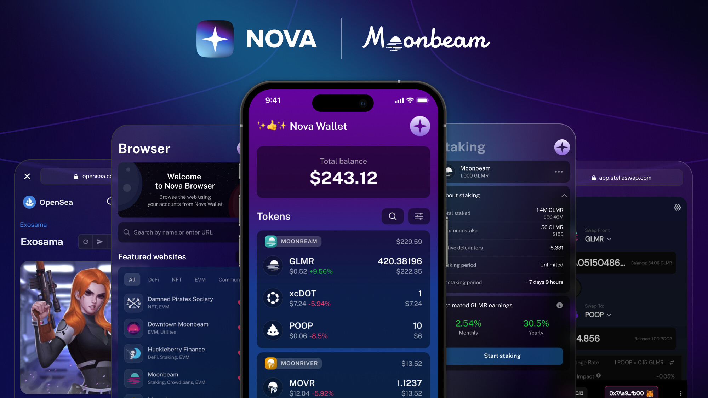

# Nova Wallet Moonbeam Treasury proposal:
 # Milestone 1 — ERC20 tokens integration and management

# **1. Abstract**

This proposal aims to extend [Nova Wallet](https://novawallet.io) assets management by introducing support for ERC-20 tokens. In addition to that, doing so will significantly simplify further integration of EVM features, such as extending supported NFTs with ERC-721, ERC-1155, Moonbeam Ledger integration, and any other features that utilize the EVM side of the Moonbeam ecosystem.

# **2. Motivation**

Moonbeam eco users are showing demand (e.g. recent [feature request](https://novawallet.canny.io/feature-exploration/p/import-custom-tokens)) in managing ERC-20 tokens of Moonbeam eco, as well as asking for more EVM features available right in [Nova Wallet](https://novawallet.io).

Our motivation is iteratively to expand the feature set of Nova, starting with this proposal, and ERC-20 tokens management seems to be the scope that will not only provide a user-friendly interface for managing all Polkadot/Kusama ecosystem tokens but also will establish a foundation in Nova’s code base for incorporating more Moonbeam EVM features, allowing Moonbeam users to utilize a complete spectrum of ecosystem features in a mobile format.

We would like to hear the feedback for the proposed set of features in M1 (this proposal), as well as collect ideas/suggestions for the feature set in future proposals (M2, M3, etc) to adjust the proposed priorities/scope.

# **3. Project Overview and Team Experience**

[Nova Wallet](https://novawallet.io) is a next-gen mobile app for Polkadot eco & beyond:
:milky_way: 63+ Polkadot networks
:sparkling_heart: Amazing UX/UI
:sparkles: Community-focused
:zap: Fast & Feature-rich
:twisted_rightwards_arrows: 140+ Cross-chain transfers
:pancakes: GLMR, MOVR, DOT, KSM, PDEX, AZERO, TUR, CAP, KMA user-friendly onchain staking
:rocket: Polkadot & Kusama Crowdloans
:globe_with_meridians: DApp browser with Polkadot JS & MetaMask integration
:bird: Access to RMRK & Statemine NFTs
:iphone: Hardware wallets support: Parity Signer, Ledger Nano X
:mechanical_arm: Secure & Open source

Recent Achievements of Nova
1 [Leading mobile app for cross-chain transfers in Polkadot & Kusama eco](https://twitter.com/NovaWalletApp/status/1562843135423954950)
2 The first and only mobile app with hardware wallets support in eco: [Parity Signer](https://twitter.com/NovaWalletApp/status/1557683901232971778) & [Ledger](https://twitter.com/NovaWalletApp/status/1569663388913123329)
3 [Nova Wallet & Moonbeam: The Ultimate Wallet Experience!](https://novawalletapp.medium.com/nova-wallet-moonbeam-the-ultimate-wallet-experience-d72b2055837d)

Our team has been developing native mobile apps for Substrate/Polkadot eco for more than 3 years now. Recently we expanded the team size of Nova from 8 to 11 to increase the development velocity and quality of our products. In parallel, the second project of Novasama Technologies — Omni Enterprise, a desktop app for Polkadot eco — is being built by our second, newly formed team. We are the patrons of the Polkadot ecosystem and a highly motivated team to elevate the UX of user-facing applications, with the goal of them being the leading apps in the web3 industry.

Apart from developing the mobile & desktop apps themselves, our team is consistently contributing to the ecosystem by providing open source SDK, design assets, knowledge-sharing sessions, and infrastructure. Examples:

1. Substrate SDKs for [iOS](https://github.com/nova-wallet/substrate-sdk-ios) and [Android](https://github.com/nova-wallet/substrate-sdk-android) development
2. [Nova Utils GitHub](https://github.com/nova-wallet/nova-utils) — metadata & configs for networks, crowdloans, DApps, cross-chain transfers
3. SubQuery API projects [developed](https://github.com/nova-wallet/subquery-nova) and [hosted](https://nova-wallet.github.io/subquery-nova/) by Nova Wallet team
4. [Nova Assets Figma](https://www.figma.com/community/file/1039874427311142565) — Polkadot eco tokens, networks, DApps

# **4. Rationale**

The [Nova Wallet](https://novawallet.io) has become a leading choice for most of the users in the Polkadot & Moonbeam ecosystem when it comes for operating with the assets on a mobile device (read more in the article: [Nova Wallet & Moonbeam: The Ultimate Wallet Experience!](https://novawalletapp.medium.com/nova-wallet-moonbeam-the-ultimate-wallet-experience-d72b2055837d)) due to the rich set of features its providing.
However, the majority of existing features are relying only on Substrate-based side of the Moonbeam ecosystem, therefore some of the features cannot be accessed via Nova at this moment.

The M1 proposal would expand amount of supported assets of Moonbeam & Moonriver in Nova Wallet from 26 to 10 044 tokens by adding support of ERC-20 (ref: [Moonbeam](https://moonbeam.subscan.io/assets?tab=erc20), [Moonriver](https://moonriver.subscan.io/assets?tab=erc20) ERC-20)

We believe that the rationality of this and upcoming proposals would be to have Nova Wallet as complete mobile app for the Moonbeam ecosystem which would be able to serve any intent of Moonbeam users.

We also believe that nowadays majority of users are relying on mobile access when it comes to managing their assets, therefore having a complete mobile app like Nova would allow expanding the user base for the Moonbeam ecosystem.

# **5. Overall Cost & Scope** 

Table below describes our vision for M1 and ERC-20 tokens integration scope:

| **Theme**                                          	| **Feature**                                                                                                                      	| **Description**                                                                                                                                                                               	|
|----------------------------------------------------	|----------------------------------------------------------------------------------------------------------------------------------	|-----------------------------------------------------------------------------------------------------------------------------------------------------------------------------------------------	|
| **1. Expand supported tokens: ERC-20 support ** 	| 1.1 Plug/maintain the collection of known and verified ERC-20 assets on Moonbeam/Moonriver, extend database to support ERC-20 tokens 	| For fetching name, ticker, and precision of known ERC-20 so that users would be able to see all tokens in one app.                                                                            	|
|                                                    	| 1.2 Display by default only those which are “Whitelisted”                                                                            	| Nova will maintain a list of “whitelisted” or “default” ERC-20 tokens for Moonbeam/Moonriver to show to the user                                                                              	|
|                                                    	| 1.3 In Assets management allow the user to Add any ERC-20 token by the address                                                       	| Adding any token to the Nova by ERC-20 address.If the certain token is unknown, still allow the user to add it, however, ask them to paste the required information: name, ticker & precision 	|
|                                                    	| 1.4 Enable/disable any known token                                                                                                   	| Allows user to enable/disable any “whitelisted” token by Nova for a better experience                                                                                                         	|
|                                                    	| 1.5 Add data source for Operation history for ERC-20 tokens                                                                          	| ERC-20 operation history would be first bootstrapped via Moonscan (Etherscan) API and later one plugged to Nova’s SubQuery infrastructure                                                     	|
|                                                    	| 1.6 Implement transfer call and calls for fetching the network fees, nonce                                                           	| To provide a better flow of transfers  Note: Cross-chain transfers will still use Substrate API due to how fees are calculated on other networks                                           	|
| **2. EVM Networking**                                 	| 2.1 Integrate WebSocket connection for EVM API to fetch/update balances                                                              	| Required tech stack to build in Nova for EVM features & specifics                                                                                                                             	|
|                                                    	| 2.2 Integrate web3 library for EVM operations                                                                                        	|                                                                                                                                                                                               	|
|                                                    	| 2.3 Block parsing to fetch events and balances changes                                                                               	|                                                                                                                                                                                               	|
|                                                    	| 2.4 Autobalance EVM nodes depending on response time and/or health-check API result                                                  	|                                                                                                                                                                                               	|

[Nova Wallet](https://novawallet.io) team for M1 Moonbeam proposal:

* Anton Khvorov — CEO & Engineering Team Lead
* Ruslan Rezin — CTO & Lead iOS Engineer
* Valentin Sergeev — Lead Android Engineer
* Gulnaz Almuhametova — Senior iOS Engineer
* Antony Zelinsky — Senior Android Engineer
* Stepan Lavrentyev — Lead QA Engineer & DevOps
* Lev Patolya — Senior QA Engineer
* Andrey Balashov — UX/UI Designer

Proposal Execution: 3—4 weeks

* 3 weeks of development
* 2 weeks of testing (starts after 1—2 weeks of development)

Payment details:

* Hourly rate: 120 USD
* Total team hours: 640

|                    Theme                   	| Man-hours Estimate (hours) 	|                           	|                      	|                         	|                          	|                   	|       	|
|:------------------------------------------:	|:--------------------------:	|:-------------------------:	|:--------------------:	|:-----------------------:	|:------------------------:	|:-----------------:	|:-----:	|
|                                            	|    iOS engineer 2 FTE   	| Android engineer 2 FTE 	| QA engineer 2 FTE 	| UX/UI designer 1 FTE 	| DevOps engineer 1 FTE 	| Team Lead 1FTE 	| Total 	|
| Expand supported tokens: ERC-20 support 	|             90             	|             90            	|          90          	|            20           	|            20            	|         90        	|  400  	|
| EVM Networking                             	|             60             	|             60            	|          60          	|            0            	|             0            	|         60        	|  240  	|
|                                      Total 	|                            	|                           	|                      	|                         	|                          	|                   	|  640  	|

Clarifications for the table above:

* While we have 2 engineers per platform (iOS/Android), Lead engineers will be involved in full-time development during all 3 weeks of development (120 hours), and the rest is allocated to Senior engineers for minor tasks execution & code-review activities (30 hours)
* 2 QA engineers are splitting the work between each other equally
* UX/UI designer is needed for M1 for minor tasks (prepare mockups for trivial features, such as “1.3 Add any ERC-20 token”), and there is no need for any UX/UI for EVM Networking features
* DevOps engineer is needed for setting up the GitHub environment for “whitelisted” tokens and infrastructure operations
* Team Lead is responsible for contributing to software architecture, design, and proposal execution & reporting

## Total amount for M1: **76 800 USD**

Requested amount is going to be divided between Moonbeam and Moonriver treasury in 80-20 ratio (respectfully):

* Moonbeam part: $61 440:
127 363.18 GLMR
based on WMA(30): GLMR: 0.4824 (Binance)
* Moonriver part: $15 360:
1 416.97 MOVR
based on WMA(30): MOVR: 10.84 (Binance)
Please let us know if you have any suggestions or comments before we do so. Thank you!

# **6. Use of Treasury Funds**

The treasury funds would be used for paying out to Novasama Technologies PTE LTD company for development expenses. The proposal execution will be started if the proposal will be approved.

This proposal covers M1 expenses and will allow us to propose future proposals (M2, M3) for developing such features, like:

* Expand supported NFTs: ERC-721, ERC-1155 support
* Hardware Wallets: Add Ledger support for Moonbeam/Moonriver
* Improvements to existing Moonbeam/Moonriver features in Nova

# **7. Specifications**

EVM-specific technical stack that is going to be integrated for M1 features:

* web3j libraries for [Android (Java)](https://github.com/web3j/web3j) and [iOS (Swift)](https://github.com/skywinder/web3swift)
* [Moonscan API](https://moonbeam.moonscan.io/apis) (based on Etherscan API) for fetching operation history
Note: For future release we might unite existing way to fetch operation history for Substrate-based networks (via SubQuery) and new one for EVM-based networks in one datasource (might be SubQuery, Subsquid, etc)

Thank you for your attention and please let us know if you have any questsions/suggestions!
We would be more than happy to discuss them

# Update 15-11-2022:

— Added information about amount divided in Moonbeam and Moonriver treasury proposals
— Treasury proposals have been submitted.

* Moonbeam Proposal #4: [Polkassembly](https://moonbeam.polkassembly.network/treasury/4)
* Moonriver Proposal #0: [Polkassembly](https://moonriver.polkassembly.network/treasury/0)

The beneficiary is a multisig account of Novasama Technologies.

* Moonbeam: `0x232Bcd499e860BFcd240cf3c491654af77d79df9`
* Moonriver: `0x00894ae26dDFF53B6bD1159B0F30fEC444fB55c0`